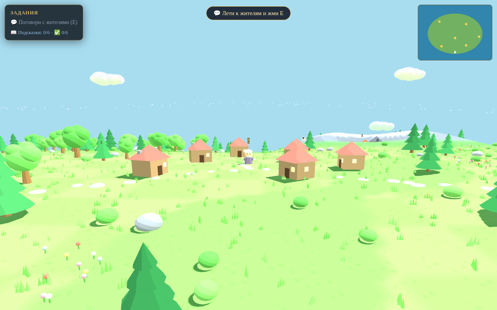
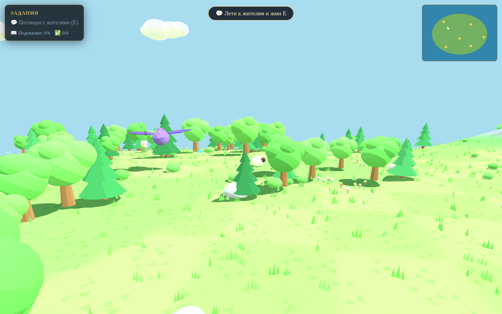
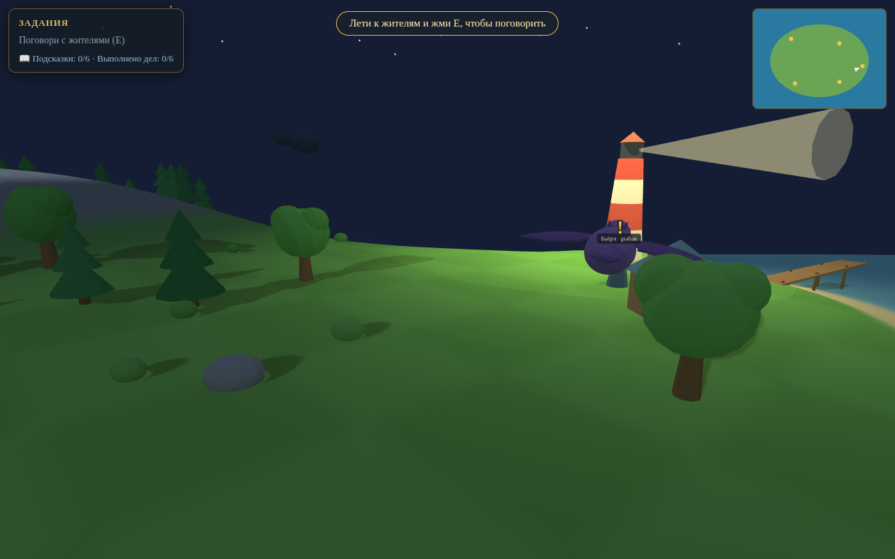
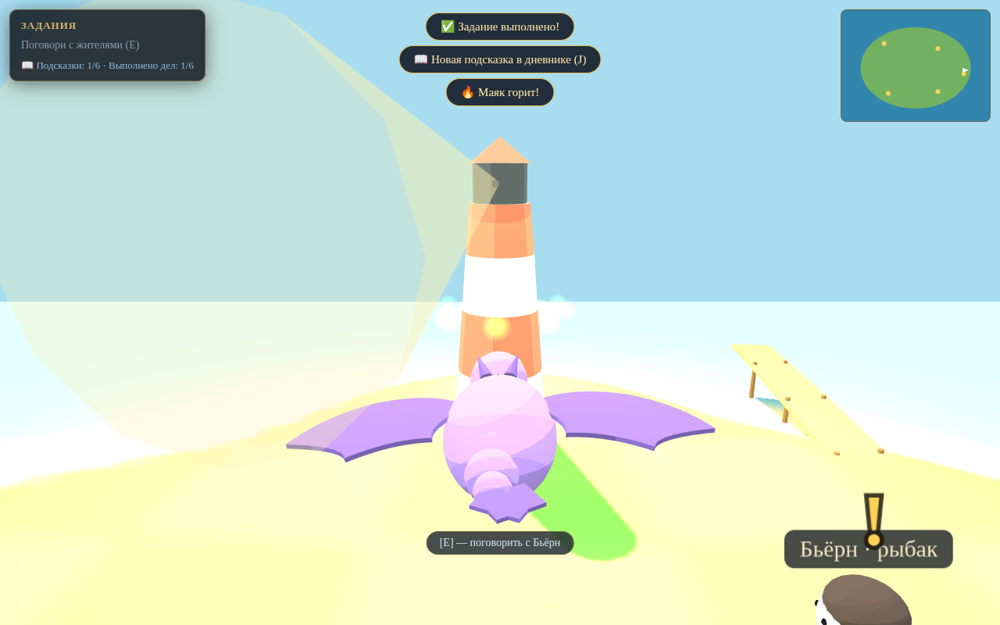

# 🐉 Драконье сердце

3D-игра в браузере, вдохновлённая миром «Как приручить дракона»,
с визуальным стилем в духе Animal Crossing: пастельные цвета, игрушечный
низкополигональный остров, чиби-жители и «заворачивающийся» за горизонт мир.

Ты — молодая дракониха **Искра**, прилетевшая на остров **Скайхольм**. Старая
драконья песня говорит: у каждого дракона где-то живёт его человек. На острове
шесть жителей, и один из них — твой. Помогай жителям, выполняй задания,
собирай подсказки в дневнике и догадайся, кто станет твоим человеком.
Хозяин выбирается случайно в каждой новой игре.






## Как играть

Просто открой `index.html` в браузере — игра написана на Three.js
(библиотека лежит в `lib/`, интернет не нужен), без сборки и установки.

Либо запусти локальный сервер:

```bash
python3 -m http.server 8000
# и открой http://localhost:8000
```

Классическая 2D-версия игры сохранена в `classic-2d.html`.

## Управление

### Клавиатура

| Клавиша | Действие |
|---|---|
| `W` / `↑` | Лететь вперёд |
| `S` / `↓` | Тормозить |
| `A D` / `← →` | Поворот |
| `Shift` | Ускорение |
| `E` | Поговорить / подобрать / отдать |
| `Пробел` | Огненное дыхание |
| `J` | Дневник (подсказки и жители) |
| `H` | Помощь |
| `M` | Звук вкл/выкл |

### Сенсорный экран (iPad и другие планшеты/телефоны)

На устройствах с сенсорным экраном автоматически появляется touch-управление:

| Элемент | Действие |
|---|---|
| Виртуальный стик слева | Полёт: вверх — вперёд, в стороны — поворот, вниз — тормоз |
| `🔥` (держать) | Огненное дыхание |
| `✋` | Поговорить / подобрать / отдать |
| `💨` (держать) | Ускорение |
| `📖` | Дневник |
| `🔊` | Звук вкл/выкл |

Стик появляется там, где палец коснулся левой части экрана. Удобнее всего
играть в ландшафтной ориентации. Если добавить страницу на экран «Домой»
(Поделиться → «На экран “Домой”»), игра откроется на весь экран без панелей
Safari.

## Задания

У каждого из шести жителей есть дело для дракона:

- **Олаф, старейшина** — зажечь погасший маяк огненным дыханием
- **Ингрид, пастушка** — найти трёх разбежавшихся овец и принести их в загон
- **Бьёрн, рыбак** — наловить пять рыбин в море вокруг острова
- **Сольвейг, травница** — собрать пять светящихся грибов в лесу
- **Эйнар, кузнец** — принести уголь из гор и раздуть горн пламенем
- **Лейф, юнга** — прогнать диких кабанов с поля

За каждое выполненное задание в дневнике появляется подсказка о твоём будущем
человеке: пол, возраст, цвет волос, где стоит его дом, что он носит с собой
и первая буква имени. Когда будешь уверена — подлети к жителю и скажи:
**«Ты — мой человек!»**

## Технологии

- [Three.js](https://threejs.org/) r147 (UMD-сборка в `lib/`, работает офлайн
  при открытии файла двойным кликом)
- Тун-шейдинг с 4-ступенчатым градиентом, мягкие тени, туман
- Кривизна мира в стиле Animal Crossing (вершинный шейдер через
  `onBeforeCompile`)
- Смена дня и ночи (~3,3 минуты на цикл): солнце ходит по небу, закатные
  и рассветные тона, звёзды, светлячки над лесом, светящиеся окна домов
- Рельеф острова генерируется процедурно из карты высот с вершинными
  цветами: снежная гора, альпийские склоны, озеро, пляжи
- Растительность инстансами: ёлки, лиственные деревья, кусты, цветочные
  поляны, валуны
- Звуковые эффекты — WebAudio, без файлов
